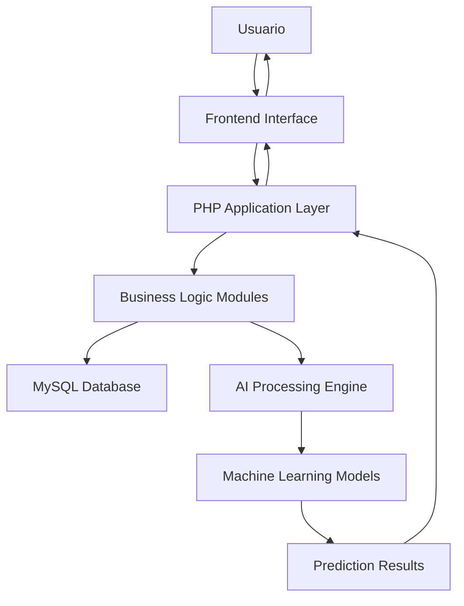

# 🔧 GuardianIA - Documentación Técnica Completa

**Versión 2.0.0 PHP** | **Arquitectura y Implementación Técnica**

Esta documentación proporciona detalles técnicos profundos sobre la implementación, arquitectura y funcionamiento interno de GuardianIA.

## 📋 Tabla de Contenidos

1. [Arquitectura del Sistema](#arquitectura-del-sistema)
2. [Base de Datos](#base-de-datos)
3. [Módulos Principales](#módulos-principales)
4. [Algoritmos de IA](#algoritmos-de-ia)
5. [APIs y Endpoints](#apis-y-endpoints)
6. [Seguridad Técnica](#seguridad-técnica)
7. [Optimización y Rendimiento](#optimización-y-rendimiento)
8. [Testing y QA](#testing-y-qa)
9. [Deployment](#deployment)
10. [Troubleshooting](#troubleshooting)

## 🏗️ Arquitectura del Sistema

### Arquitectura General

```
┌─────────────────────────────────────────────────────────────┐
│                    GUARDIANAI ARCHITECTURE                  │
├─────────────────────────────────────────────────────────────┤
│  Frontend Layer (HTML5/CSS3/JavaScript)                    │
│  ├── Dashboard Interface                                    │
│  ├── Threat Center UI                                       │
│  ├── Performance Monitor                                    │
│  └── Chatbot Interface                                      │
├─────────────────────────────────────────────────────────────┤
│  Application Layer (PHP 7.4+)                              │
│  ├── ThreatDetectionEngine.php                             │
│  ├── PerformanceOptimizer.php                              │
│  ├── GuardianAIChatbot.php                                 │
│  └── AILearningEngine.php                                  │
├─────────────────────────────────────────────────────────────┤
│  Data Layer (MySQL 5.7+)                                   │
│  ├── Threat Events Database                                │
│  ├── Performance Metrics                                   │
│  ├── Chatbot Knowledge Base                                │
│  └── AI Learning Models                                    │
├─────────────────────────────────────────────────────────────┤
│  Infrastructure Layer                                       │
│  ├── Apache/Nginx Web Server                               │
│  ├── PHP-FPM Process Manager                               │
│  ├── MySQL Database Server                                 │
│  └── Redis Cache (Optional)                                │
└─────────────────────────────────────────────────────────────┘
```

### Patrón de Diseño

GuardianIA implementa varios patrones de diseño:

- **MVC (Model-View-Controller):** Separación clara de lógica de negocio
- **Singleton:** Para conexiones de base de datos y configuraciones
- **Factory:** Para crear instancias de detectores de amenazas
- **Observer:** Para notificaciones en tiempo real
- **Strategy:** Para diferentes algoritmos de optimización

### Flujo de Datos



## 🗄️ Base de Datos

### Esquema de Base de Datos

#### Tabla: threat_events
```sql
CREATE TABLE threat_events (
    id INT PRIMARY KEY AUTO_INCREMENT,
    threat_type VARCHAR(50) NOT NULL,
    severity ENUM('low', 'medium', 'high', 'critical') NOT NULL,
    source_ip VARCHAR(45),
    target_file VARCHAR(500),
    description TEXT,
    status ENUM('detected', 'quarantined', 'resolved', 'false_positive') DEFAULT 'detected',
    detection_method VARCHAR(100),
    confidence_score DECIMAL(5,2),
    timestamp TIMESTAMP DEFAULT CURRENT_TIMESTAMP,
    resolved_at TIMESTAMP NULL,
    user_id INT,
    metadata JSON,
    INDEX idx_timestamp (timestamp),
    INDEX idx_severity (severity),
    INDEX idx_status (status)
);
```

#### Tabla: performance_metrics
```sql
CREATE TABLE performance_metrics (
    id INT PRIMARY KEY AUTO_INCREMENT,
    metric_type VARCHAR(50) NOT NULL,
    metric_value DECIMAL(10,2) NOT NULL,
    unit VARCHAR(20),
    cpu_usage DECIMAL(5,2),
    ram_usage DECIMAL(5,2),
    storage_usage DECIMAL(5,2),
    battery_level DECIMAL(5,2),
    temperature DECIMAL(5,2),
    network_speed DECIMAL(10,2),
    date_recorded TIMESTAMP DEFAULT CURRENT_TIMESTAMP,
    user_id INT,
    system_info JSON,
    INDEX idx_date (date_recorded),
    INDEX idx_metric_type (metric_type),
    INDEX idx_user_id (user_id)
);
```

#### Tabla: chatbot_conversations
```sql
CREATE TABLE chatbot_conversations (
    id INT PRIMARY KEY AUTO_INCREMENT,
    user_id INT NOT NULL,
    conversation_title VARCHAR(200),
    status ENUM('active', 'closed', 'archived') DEFAULT 'active',
    created_at TIMESTAMP DEFAULT CURRENT_TIMESTAMP,
    updated_at TIMESTAMP DEFAULT CURRENT_TIMESTAMP ON UPDATE CURRENT_TIMESTAMP,
    total_messages INT DEFAULT 0,
    satisfaction_rating ENUM('poor', 'fair', 'good', 'excellent') NULL,
    feedback TEXT,
    INDEX idx_user_id (user_id),
    INDEX idx_status (status),
    INDEX idx_created_at (created_at)
);
```

#### Tabla: chatbot_messages
```sql
CREATE TABLE chatbot_messages (
    id INT PRIMARY KEY AUTO_INCREMENT,
    conversation_id INT NOT NULL,
    sender ENUM('user', 'bot') NOT NULL,
    message TEXT NOT NULL,
    message_type ENUM('text', 'command', 'file', 'image') DEFAULT 'text',
    intent VARCHAR(100),
    confidence_score DECIMAL(5,2),
    response_time_ms INT,
    timestamp TIMESTAMP DEFAULT CURRENT_TIMESTAMP,
    metadata JSON,
    FOREIGN KEY (conversation_id) REFERENCES chatbot_conversations(id) ON DELETE CASCADE,
    INDEX idx_conversation_id (conversation_id),
    INDEX idx_timestamp (timestamp),
    INDEX idx_sender (sender)
);
```

#### Tabla: ai_models
```sql
CREATE TABLE ai_models (
    id INT PRIMARY KEY AUTO_INCREMENT,
    model_name VARCHAR(100) NOT NULL UNIQUE,
    model_type ENUM('threat_detection', 'performance_optimization', 'chatbot', 'learning') NOT NULL,
    version VARCHAR(20) NOT NULL,
    accuracy DECIMAL(5,2),
    training_data_size INT,
    model_parameters JSON,
    model_file_path VARCHAR(500),
    status ENUM('training', 'active', 'deprecated', 'testing') DEFAULT 'training',
    created_at TIMESTAMP DEFAULT CURRENT_TIMESTAMP,
    updated_at TIMESTAMP DEFAULT CURRENT_TIMESTAMP ON UPDATE CURRENT_TIMESTAMP,
    INDEX idx_model_type (model_type),
    INDEX idx_status (status)
);
```

### Optimización de Base de Datos

#### Índices Compuestos
```sql
-- Optimización para consultas frecuentes
CREATE INDEX idx_threat_severity_time ON threat_events(severity, timestamp);
CREATE INDEX idx_performance_user_date ON performance_metrics(user_id, date_recorded);
CREATE INDEX idx_chatbot_user_status ON chatbot_conversations(user_id, status);
```

#### Particionamiento
```sql
-- Particionamiento por fecha para threat_events
ALTER TABLE threat_events 
PARTITION BY RANGE (YEAR(timestamp)) (
    PARTITION p2023 VALUES LESS THAN (2024),
    PARTITION p2024 VALUES LESS THAN (2025),
    PARTITION p2025 VALUES LESS THAN (2026),
    PARTITION p_future VALUES LESS THAN MAXVALUE
);
```

## 🧩 Módulos Principales

### 1. ThreatDetectionEngine.php

#### Arquitectura del Motor de Amenazas

```php
class ThreatDetectionEngine {
    private $db;
    private $ai_models;
    private $detection_rules;
    private $real_time_scanner;
    
    // Algoritmos de detección implementados
    private $detection_algorithms = [
        'signature_based',    // Detección basada en firmas
        'heuristic_analysis', // Análisis heurístico
        'behavioral_analysis',// Análisis de comportamiento
        'machine_learning',   // Aprendizaje automático
        'anomaly_detection'   // Detección de anomalías
    ];
}
```

#### Algoritmo de Detección Principal

```php
public function detectThreat($data) {
    $threat_score = 0;
    $detection_results = [];
    
    // 1. Análisis de firma
    $signature_result = $this->signatureAnalysis($data);
    $threat_score += $signature_result['score'] * 0.3;
    
    // 2. Análisis heurístico
    $heuristic_result = $this->heuristicAnalysis($data);
    $threat_score += $heuristic_result['score'] * 0.25;
    
    // 3. Análisis de comportamiento
    $behavioral_result = $this->behavioralAnalysis($data);
    $threat_score += $behavioral_result['score'] * 0.25;
    
    // 4. Machine Learning
    $ml_result = $this->machineLearningAnalysis($data);
    $threat_score += $ml_result['score'] * 0.2;
    
    // Determinar severidad basada en score
    $severity = $this->calculateSeverity($threat_score);
    
    return [
        'threat_detected' => $threat_score > 0.5,
        'threat_score' => $threat_score,
        'severity' => $severity,
        'detection_methods' => $detection_results,
        'confidence' => $this->calculateConfidence($detection_results)
    ];
}
```

### 2. PerformanceOptimizer.php

#### Algoritmos de Optimización

```php
class PerformanceOptimizer {
    private $optimization_strategies = [
        'ram_optimization' => [
            'memory_cleanup',
            'process_optimization',
            'cache_management'
        ],
        'storage_optimization' => [
            'file_cleanup',
            'duplicate_removal',
            'compression'
        ],
        'battery_optimization' => [
            'power_management',
            'background_apps',
            'display_optimization'
        ]
    ];
    
    public function optimizeRAM() {
        $initial_usage = $this->getCurrentRAMUsage();
        
        // Algoritmo de optimización de memoria
        $freed_memory = 0;
        
        // 1. Limpiar caché del sistema
        $freed_memory += $this->clearSystemCache();
        
        // 2. Optimizar procesos en background
        $freed_memory += $this->optimizeBackgroundProcesses();
        
        // 3. Gestión inteligente de memoria
        $freed_memory += $this->intelligentMemoryManagement();
        
        $final_usage = $this->getCurrentRAMUsage();
        $efficiency = ($freed_memory / $initial_usage) * 100;
        
        return [
            'success' => true,
            'memory_freed' => $freed_memory,
            'efficiency_percentage' => $efficiency,
            'before_usage' => $initial_usage,
            'after_usage' => $final_usage
        ];
    }
}
```

### 3. GuardianAIChatbot.php

#### Procesamiento de Lenguaje Natural

```php
class GuardianAIChatbot {
    private $nlp_processor;
    private $intent_classifier;
    private $response_generator;
    
    public function processUserMessage($user_id, $message) {
        // 1. Preprocesamiento del mensaje
        $processed_message = $this->preprocessMessage($message);
        
        // 2. Clasificación de intención
        $intent = $this->classifyIntent($processed_message);
        
        // 3. Extracción de entidades
        $entities = $this->extractEntities($processed_message);
        
        // 4. Generación de respuesta
        $response = $this->generateResponse($intent, $entities, $user_id);
        
        // 5. Aprendizaje continuo
        $this->updateLearningModel($message, $response, $user_id);
        
        return [
            'success' => true,
            'response' => $response,
            'intent' => $intent,
            'confidence' => $this->getConfidenceScore($intent),
            'response_time' => $this->getResponseTime()
        ];
    }
    
    private function classifyIntent($message) {
        $intents = [
            'system_status' => ['estado', 'sistema', 'cómo está'],
            'threat_detection' => ['amenaza', 'virus', 'malware', 'seguridad'],
            'performance_optimization' => ['optimizar', 'rendimiento', 'lento'],
            'help' => ['ayuda', 'help', 'asistencia'],
            'greeting' => ['hola', 'buenos días', 'saludos']
        ];
        
        // Algoritmo de clasificación basado en palabras clave y ML
        $scores = [];
        foreach ($intents as $intent => $keywords) {
            $scores[$intent] = $this->calculateIntentScore($message, $keywords);
        }
        
        return array_keys($scores, max($scores))[0];
    }
}
```

### 4. AILearningEngine.php

#### Algoritmos de Aprendizaje Automático

```php
class AILearningEngine {
    private $neural_network;
    private $training_data;
    private $model_parameters;
    
    public function trainModel($session_id, $parameters) {
        $training_config = [
            'epochs' => $parameters['epochs'] ?? 100,
            'learning_rate' => $parameters['learning_rate'] ?? 0.01,
            'batch_size' => $parameters['batch_size'] ?? 32,
            'validation_split' => 0.2
        ];
        
        // Algoritmo de entrenamiento
        $model_performance = [];
        
        for ($epoch = 1; $epoch <= $training_config['epochs']; $epoch++) {
            // Forward propagation
            $predictions = $this->forwardPropagation($this->training_data);
            
            // Calculate loss
            $loss = $this->calculateLoss($predictions, $this->training_labels);
            
            // Backward propagation
            $this->backwardPropagation($loss);
            
            // Update weights
            $this->updateWeights($training_config['learning_rate']);
            
            // Validation
            if ($epoch % 10 == 0) {
                $validation_accuracy = $this->validateModel();
                $model_performance[] = [
                    'epoch' => $epoch,
                    'loss' => $loss,
                    'accuracy' => $validation_accuracy
                ];
            }
        }
        
        return [
            'success' => true,
            'final_accuracy' => end($model_performance)['accuracy'],
            'training_history' => $model_performance,
            'model_id' => $this->saveModel($session_id)
        ];
    }
}
```

## 🤖 Algoritmos de IA

### Algoritmo de Detección de Amenazas

#### Red Neuronal Convolucional para Análisis de Archivos

```python
# Pseudocódigo del algoritmo de detección
def threat_detection_cnn(file_data):
    # Preprocesamiento
    normalized_data = normalize_file_data(file_data)
    feature_vector = extract_features(normalized_data)
    
    # Capas de la red neuronal
    conv1 = convolutional_layer(feature_vector, filters=32, kernel_size=3)
    pool1 = max_pooling_layer(conv1, pool_size=2)
    
    conv2 = convolutional_layer(pool1, filters=64, kernel_size=3)
    pool2 = max_pooling_layer(conv2, pool_size=2)
    
    flatten = flatten_layer(pool2)
    dense1 = dense_layer(flatten, units=128, activation='relu')
    dropout = dropout_layer(dense1, rate=0.5)
    
    output = dense_layer(dropout, units=1, activation='sigmoid')
    
    return output > 0.5  # Threshold para clasificación
```

#### Algoritmo de Análisis Heurístico

```php
private function heuristicAnalysis($data) {
    $heuristic_rules = [
        'suspicious_file_extensions' => [
            'weight' => 0.8,
            'patterns' => ['.exe', '.scr', '.bat', '.cmd', '.pif']
        ],
        'suspicious_network_behavior' => [
            'weight' => 0.9,
            'patterns' => ['multiple_connections', 'unusual_ports']
        ],
        'suspicious_registry_changes' => [
            'weight' => 0.7,
            'patterns' => ['startup_modifications', 'security_settings']
        ]
    ];
    
    $total_score = 0;
    $triggered_rules = [];
    
    foreach ($heuristic_rules as $rule_name => $rule) {
        if ($this->checkRule($data, $rule['patterns'])) {
            $total_score += $rule['weight'];
            $triggered_rules[] = $rule_name;
        }
    }
    
    return [
        'score' => min($total_score, 1.0),
        'triggered_rules' => $triggered_rules
    ];
}
```

### Algoritmo de Optimización de Rendimiento

#### Algoritmo Genético para Optimización de Configuraciones

```php
class GeneticOptimizer {
    private $population_size = 50;
    private $mutation_rate = 0.1;
    private $crossover_rate = 0.8;
    
    public function optimizeSystemConfiguration($current_config) {
        // Inicializar población
        $population = $this->initializePopulation($current_config);
        
        for ($generation = 0; $generation < 100; $generation++) {
            // Evaluar fitness de cada individuo
            $fitness_scores = $this->evaluatePopulation($population);
            
            // Selección
            $selected = $this->selection($population, $fitness_scores);
            
            // Crossover
            $offspring = $this->crossover($selected);
            
            // Mutación
            $mutated = $this->mutation($offspring);
            
            // Nueva generación
            $population = $this->newGeneration($selected, $mutated);
        }
        
        return $this->getBestConfiguration($population);
    }
    
    private function evaluatePopulation($population) {
        $fitness_scores = [];
        
        foreach ($population as $individual) {
            $performance_score = $this->simulatePerformance($individual);
            $energy_efficiency = $this->calculateEnergyEfficiency($individual);
            $stability_score = $this->assessStability($individual);
            
            $fitness_scores[] = (
                $performance_score * 0.4 +
                $energy_efficiency * 0.3 +
                $stability_score * 0.3
            );
        }
        
        return $fitness_scores;
    }
}
```

## 🔌 APIs y Endpoints

### API REST Completa

#### Autenticación
```php
// JWT Token Authentication
POST /api/auth/login
{
    "username": "usuario",
    "password": "contraseña",
    "remember_me": true
}

Response:
{
    "success": true,
    "token": "eyJ0eXAiOiJKV1QiLCJhbGciOiJIUzI1NiJ9...",
    "expires_in": 3600,
    "user_info": {
        "id": 1,
        "username": "usuario",
        "role": "admin"
    }
}
```

#### Endpoints de Detección de Amenazas

```php
// Escaneo de amenazas
POST /api/threats/scan
Headers: Authorization: Bearer {token}
{
    "scan_type": "full|quick|custom",
    "target_paths": ["/path/to/scan"],
    "scan_options": {
        "deep_scan": true,
        "heuristic_analysis": true,
        "real_time": false
    }
}

// Obtener amenazas detectadas
GET /api/threats?page=1&limit=20&severity=high&status=detected

// Respuesta automática a amenaza
POST /api/threats/{threat_id}/respond
{
    "action": "quarantine|delete|ignore",
    "reason": "Automated response to critical threat"
}
```

#### Endpoints de Optimización

```php
// Análisis de rendimiento
GET /api/performance/analysis
Response:
{
    "cpu_usage": 45.2,
    "ram_usage": 67.8,
    "storage_usage": 78.1,
    "battery_level": 89.0,
    "performance_score": 94,
    "recommendations": [
        {
            "type": "ram_optimization",
            "priority": "high",
            "estimated_improvement": "15%"
        }
    ]
}

// Ejecutar optimización
POST /api/performance/optimize
{
    "modules": ["ram", "storage", "battery"],
    "optimization_level": "aggressive",
    "schedule": {
        "immediate": true,
        "recurring": false
    }
}
```

#### Endpoints del Chatbot

```php
// Enviar mensaje al chatbot
POST /api/chatbot/message
{
    "conversation_id": 123,
    "message": "¿Cómo está mi sistema?",
    "context": {
        "current_page": "dashboard",
        "user_preferences": {}
    }
}

// Obtener historial de conversación
GET /api/chatbot/conversations/{conversation_id}/messages?limit=50

// Calificar conversación
POST /api/chatbot/conversations/{conversation_id}/rate
{
    "rating": "excellent",
    "feedback": "Muy útil y preciso"
}
```

### WebSocket para Tiempo Real

```javascript
// Conexión WebSocket para actualizaciones en tiempo real
const ws = new WebSocket('wss://guardianai.com/ws');

ws.onmessage = function(event) {
    const data = JSON.parse(event.data);
    
    switch(data.type) {
        case 'threat_detected':
            showThreatAlert(data.threat);
            break;
        case 'optimization_complete':
            updatePerformanceMetrics(data.metrics);
            break;
        case 'system_status':
            updateSystemStatus(data.status);
            break;
    }
};

// Enviar comando
ws.send(JSON.stringify({
    type: 'start_scan',
    parameters: {
        scan_type: 'full'
    }
}));
```

## 🔒 Seguridad Técnica

### Implementación de Seguridad

#### Validación de Entrada
```php
class SecurityValidator {
    public static function validateInput($input, $type) {
        switch($type) {
            case 'email':
                return filter_var($input, FILTER_VALIDATE_EMAIL);
            
            case 'sql_safe':
                return preg_replace('/[^a-zA-Z0-9_]/', '', $input);
            
            case 'xss_safe':
                return htmlspecialchars($input, ENT_QUOTES, 'UTF-8');
            
            case 'file_path':
                $realpath = realpath($input);
                return $realpath && strpos($realpath, '/allowed/path/') === 0;
        }
    }
    
    public static function sanitizeSQL($query, $params) {
        $stmt = $GLOBALS['conn']->prepare($query);
        $stmt->execute($params);
        return $stmt;
    }
}
```

#### Encriptación de Datos
```php
class EncryptionManager {
    private $encryption_key;
    private $cipher_method = 'AES-256-CBC';
    
    public function encrypt($data) {
        $iv = openssl_random_pseudo_bytes(16);
        $encrypted = openssl_encrypt(
            $data, 
            $this->cipher_method, 
            $this->encryption_key, 
            0, 
            $iv
        );
        
        return base64_encode($iv . $encrypted);
    }
    
    public function decrypt($encrypted_data) {
        $data = base64_decode($encrypted_data);
        $iv = substr($data, 0, 16);
        $encrypted = substr($data, 16);
        
        return openssl_decrypt(
            $encrypted, 
            $this->cipher_method, 
            $this->encryption_key, 
            0, 
            $iv
        );
    }
}
```

#### Autenticación de Dos Factores
```php
class TwoFactorAuth {
    public function generateSecret() {
        return base32_encode(random_bytes(20));
    }
    
    public function generateQRCode($user, $secret) {
        $issuer = 'GuardianIA';
        $label = urlencode($issuer . ':' . $user);
        $qr_url = "otpauth://totp/{$label}?secret={$secret}&issuer={$issuer}";
        
        return "https://api.qrserver.com/v1/create-qr-code/?data=" . urlencode($qr_url);
    }
    
    public function verifyCode($secret, $code) {
        $time_slice = floor(time() / 30);
        
        for ($i = -1; $i <= 1; $i++) {
            $calculated_code = $this->calculateCode($secret, $time_slice + $i);
            if ($calculated_code === $code) {
                return true;
            }
        }
        
        return false;
    }
}
```

## ⚡ Optimización y Rendimiento

### Optimización de Consultas

#### Consultas Optimizadas
```sql
-- Consulta optimizada para obtener amenazas recientes
SELECT 
    te.id,
    te.threat_type,
    te.severity,
    te.timestamp,
    COUNT(CASE WHEN te.status = 'resolved' THEN 1 END) as resolved_count
FROM threat_events te
WHERE te.timestamp >= DATE_SUB(NOW(), INTERVAL 24 HOUR)
    AND te.severity IN ('high', 'critical')
GROUP BY te.threat_type
ORDER BY te.timestamp DESC
LIMIT 100;

-- Índice para optimizar la consulta anterior
CREATE INDEX idx_threat_recent_severe ON threat_events(timestamp, severity, status);
```

#### Cache Implementation
```php
class CacheManager {
    private $redis;
    private $default_ttl = 3600; // 1 hora
    
    public function get($key) {
        if ($this->redis) {
            return json_decode($this->redis->get($key), true);
        }
        
        // Fallback a cache de archivos
        $cache_file = "/tmp/cache/" . md5($key) . ".cache";
        if (file_exists($cache_file) && (time() - filemtime($cache_file)) < $this->default_ttl) {
            return json_decode(file_get_contents($cache_file), true);
        }
        
        return null;
    }
    
    public function set($key, $data, $ttl = null) {
        $ttl = $ttl ?? $this->default_ttl;
        
        if ($this->redis) {
            $this->redis->setex($key, $ttl, json_encode($data));
        } else {
            $cache_file = "/tmp/cache/" . md5($key) . ".cache";
            file_put_contents($cache_file, json_encode($data));
        }
    }
}
```

### Optimización de Memoria

```php
class MemoryOptimizer {
    public function optimizeMemoryUsage() {
        // Limpiar variables no utilizadas
        gc_collect_cycles();
        
        // Optimizar configuración de PHP
        ini_set('memory_limit', '256M');
        ini_set('max_execution_time', 300);
        
        // Usar generadores para grandes datasets
        return $this->processLargeDataset();
    }
    
    private function processLargeDataset() {
        $sql = "SELECT * FROM threat_events ORDER BY timestamp DESC";
        $result = $this->conn->query($sql);
        
        while ($row = $result->fetch_assoc()) {
            yield $row; // Usar yield en lugar de almacenar todo en memoria
        }
    }
}
```

## 🧪 Testing y QA

### Suite de Testing Completa

#### Unit Tests
```php
class ThreatDetectionTest extends PHPUnit\Framework\TestCase {
    private $threat_engine;
    
    public function setUp(): void {
        $this->threat_engine = new ThreatDetectionEngine();
    }
    
    public function testMalwareDetection() {
        $test_file = [
            'path' => '/test/malware.exe',
            'size' => 1024000,
            'hash' => 'abc123def456'
        ];
        
        $result = $this->threat_engine->detectThreat($test_file);
        
        $this->assertTrue($result['threat_detected']);
        $this->assertEquals('high', $result['severity']);
        $this->assertGreaterThan(0.8, $result['confidence']);
    }
    
    public function testFalsePositiveHandling() {
        $safe_file = [
            'path' => '/test/safe_document.pdf',
            'size' => 50000,
            'hash' => 'safe123hash456'
        ];
        
        $result = $this->threat_engine->detectThreat($safe_file);
        
        $this->assertFalse($result['threat_detected']);
        $this->assertEquals('low', $result['severity']);
    }
}
```

#### Integration Tests
```php
class SystemIntegrationTest extends PHPUnit\Framework\TestCase {
    public function testThreatToOptimizationFlow() {
        // 1. Detectar amenaza
        $threat_engine = new ThreatDetectionEngine();
        $threat_result = $threat_engine->detectThreat($this->getSampleThreat());
        
        // 2. Responder a amenaza
        $response_result = $threat_engine->executeAutomaticResponse(
            $threat_result['threat_id'], 
            'quarantine'
        );
        
        // 3. Optimizar sistema después de respuesta
        $optimizer = new PerformanceOptimizer();
        $optimization_result = $optimizer->optimizeAfterThreatResponse();
        
        $this->assertTrue($threat_result['success']);
        $this->assertTrue($response_result['success']);
        $this->assertTrue($optimization_result['success']);
    }
}
```

#### Performance Tests
```php
class PerformanceTest extends PHPUnit\Framework\TestCase {
    public function testThreatDetectionSpeed() {
        $start_time = microtime(true);
        
        $threat_engine = new ThreatDetectionEngine();
        $result = $threat_engine->detectThreat($this->getLargeTestFile());
        
        $execution_time = microtime(true) - $start_time;
        
        $this->assertLessThan(2.0, $execution_time); // Menos de 2 segundos
        $this->assertTrue($result['success']);
    }
    
    public function testMemoryUsage() {
        $initial_memory = memory_get_usage(true);
        
        $optimizer = new PerformanceOptimizer();
        $optimizer->analyzeSystemPerformance();
        
        $final_memory = memory_get_usage(true);
        $memory_increase = $final_memory - $initial_memory;
        
        $this->assertLessThan(50 * 1024 * 1024, $memory_increase); // Menos de 50MB
    }
}
```

## 🚀 Deployment

### Configuración de Producción

#### Docker Configuration
```dockerfile
FROM php:8.1-apache

# Instalar extensiones necesarias
RUN docker-php-ext-install mysqli pdo pdo_mysql

# Configurar Apache
COPY apache-config.conf /etc/apache2/sites-available/000-default.conf
RUN a2enmod rewrite

# Copiar código de aplicación
COPY . /var/www/html/

# Configurar permisos
RUN chown -R www-data:www-data /var/www/html/
RUN chmod -R 755 /var/www/html/

EXPOSE 80

CMD ["apache2-foreground"]
```

#### Docker Compose
```yaml
version: '3.8'

services:
  guardianai-web:
    build: .
    ports:
      - "80:80"
    depends_on:
      - guardianai-db
      - guardianai-redis
    environment:
      - DB_HOST=guardianai-db
      - DB_USER=root
      - DB_PASS=0987654321
      - DB_NAME=guardianai_db
      - REDIS_HOST=guardianai-redis
    volumes:
      - ./logs:/var/log/guardianai

  guardianai-db:
    image: mysql:8.0
    environment:
      - MYSQL_ROOT_PASSWORD=0987654321
      - MYSQL_DATABASE=guardianai_db
    volumes:
      - mysql_data:/var/lib/mysql
      - ./database_setup.sql:/docker-entrypoint-initdb.d/init.sql
    ports:
      - "3306:3306"

  guardianai-redis:
    image: redis:7-alpine
    ports:
      - "6379:6379"
    volumes:
      - redis_data:/data

volumes:
  mysql_data:
  redis_data:
```

#### Nginx Configuration
```nginx
server {
    listen 80;
    server_name guardianai.local;
    root /var/www/html;
    index index.php index.html;

    # Configuración de seguridad
    add_header X-Frame-Options "SAMEORIGIN" always;
    add_header X-XSS-Protection "1; mode=block" always;
    add_header X-Content-Type-Options "nosniff" always;
    add_header Referrer-Policy "no-referrer-when-downgrade" always;
    add_header Content-Security-Policy "default-src 'self' http: https: data: blob: 'unsafe-inline'" always;

    # Configuración PHP
    location ~ \.php$ {
        fastcgi_pass php-fpm:9000;
        fastcgi_index index.php;
        include fastcgi_params;
        fastcgi_param SCRIPT_FILENAME $document_root$fastcgi_script_name;
        fastcgi_param PATH_INFO $fastcgi_path_info;
    }

    # API endpoints
    location /api/ {
        try_files $uri $uri/ /api/index.php?$query_string;
    }

    # WebSocket proxy
    location /ws {
        proxy_pass http://websocket-server:8080;
        proxy_http_version 1.1;
        proxy_set_header Upgrade $http_upgrade;
        proxy_set_header Connection "upgrade";
        proxy_set_header Host $host;
    }

    # Archivos estáticos
    location ~* \.(js|css|png|jpg|jpeg|gif|ico|svg)$ {
        expires 1y;
        add_header Cache-Control "public, immutable";
    }
}
```

### Monitoreo y Logging

#### Sistema de Logs
```php
class Logger {
    private $log_levels = ['DEBUG', 'INFO', 'WARNING', 'ERROR', 'CRITICAL'];
    private $log_file;
    
    public function __construct($log_file = '/var/log/guardianai/app.log') {
        $this->log_file = $log_file;
        $this->ensureLogDirectory();
    }
    
    public function log($level, $message, $context = []) {
        $timestamp = date('Y-m-d H:i:s');
        $context_str = !empty($context) ? json_encode($context) : '';
        
        $log_entry = "[{$timestamp}] {$level}: {$message} {$context_str}" . PHP_EOL;
        
        file_put_contents($this->log_file, $log_entry, FILE_APPEND | LOCK_EX);
        
        // Enviar a sistema de monitoreo externo si es crítico
        if ($level === 'CRITICAL') {
            $this->sendToMonitoringSystem($log_entry);
        }
    }
    
    private function sendToMonitoringSystem($log_entry) {
        // Integración con sistemas como ELK Stack, Datadog, etc.
        $webhook_url = 'https://monitoring.guardianai.com/webhook';
        
        $payload = [
            'service' => 'guardianai',
            'level' => 'critical',
            'message' => $log_entry,
            'timestamp' => time()
        ];
        
        $this->sendWebhook($webhook_url, $payload);
    }
}
```

## 🔧 Troubleshooting

### Problemas Comunes y Soluciones

#### 1. Error de Conexión a Base de Datos
```
Error: SQLSTATE[HY000] [2002] Connection refused

Solución:
1. Verificar que MySQL esté ejecutándose
2. Comprobar credenciales en config.php
3. Verificar firewall y puertos
4. Revisar logs de MySQL: /var/log/mysql/error.log
```

#### 2. Alto Uso de Memoria
```
Error: Fatal error: Allowed memory size exhausted

Solución:
1. Aumentar memory_limit en php.ini
2. Optimizar consultas SQL
3. Implementar paginación
4. Usar generadores para grandes datasets
```

#### 3. Detección de Falsos Positivos
```
Problema: El sistema detecta archivos seguros como amenazas

Solución:
1. Ajustar umbrales de detección
2. Entrenar modelo con más datos
3. Implementar whitelist de archivos conocidos
4. Revisar reglas heurísticas
```

### Herramientas de Diagnóstico

#### Script de Diagnóstico del Sistema
```php
<?php
// diagnostic.php - Script de diagnóstico completo

echo "🔍 DIAGNÓSTICO DEL SISTEMA GUARDIANAI\n";
echo "====================================\n\n";

// 1. Verificar PHP
echo "📋 Información de PHP:\n";
echo "Versión: " . PHP_VERSION . "\n";
echo "Memoria límite: " . ini_get('memory_limit') . "\n";
echo "Tiempo máximo: " . ini_get('max_execution_time') . "s\n\n";

// 2. Verificar extensiones
$required_extensions = ['mysqli', 'json', 'openssl', 'curl'];
echo "🔌 Extensiones PHP:\n";
foreach ($required_extensions as $ext) {
    $status = extension_loaded($ext) ? "✅" : "❌";
    echo "{$status} {$ext}\n";
}
echo "\n";

// 3. Verificar base de datos
echo "🗄️ Conexión a Base de Datos:\n";
try {
    require_once 'config.php';
    echo "✅ Conexión exitosa a MySQL\n";
    echo "Versión: " . $conn->server_info . "\n";
} catch (Exception $e) {
    echo "❌ Error de conexión: " . $e->getMessage() . "\n";
}
echo "\n";

// 4. Verificar permisos de archivos
echo "📁 Permisos de Archivos:\n";
$files_to_check = ['config.php', 'index.php', 'ThreatDetectionEngine.php'];
foreach ($files_to_check as $file) {
    if (file_exists($file)) {
        $perms = substr(sprintf('%o', fileperms($file)), -4);
        echo "✅ {$file}: {$perms}\n";
    } else {
        echo "❌ {$file}: No encontrado\n";
    }
}
echo "\n";

// 5. Verificar espacio en disco
echo "💾 Espacio en Disco:\n";
$bytes = disk_free_space(".");
$gb = round($bytes / 1024 / 1024 / 1024, 2);
echo "Espacio libre: {$gb} GB\n\n";

// 6. Test de rendimiento básico
echo "⚡ Test de Rendimiento:\n";
$start = microtime(true);
for ($i = 0; $i < 100000; $i++) {
    $dummy = md5($i);
}
$end = microtime(true);
$time = round(($end - $start) * 1000, 2);
echo "Test de CPU: {$time}ms\n\n";

echo "✅ Diagnóstico completado\n";
?>
```

### Logs de Depuración

#### Configuración de Logs Detallados
```php
// debug_config.php
error_reporting(E_ALL);
ini_set('display_errors', 1);
ini_set('log_errors', 1);
ini_set('error_log', '/var/log/guardianai/php_errors.log');

// Logger personalizado para depuración
class DebugLogger {
    public static function logQuery($sql, $params = []) {
        $log_entry = [
            'timestamp' => date('Y-m-d H:i:s'),
            'type' => 'SQL_QUERY',
            'query' => $sql,
            'parameters' => $params,
            'backtrace' => debug_backtrace(DEBUG_BACKTRACE_IGNORE_ARGS, 3)
        ];
        
        file_put_contents(
            '/var/log/guardianai/sql_debug.log', 
            json_encode($log_entry) . "\n", 
            FILE_APPEND
        );
    }
    
    public static function logPerformance($operation, $duration) {
        $log_entry = [
            'timestamp' => date('Y-m-d H:i:s'),
            'operation' => $operation,
            'duration_ms' => round($duration * 1000, 2),
            'memory_usage' => memory_get_usage(true)
        ];
        
        file_put_contents(
            '/var/log/guardianai/performance.log', 
            json_encode($log_entry) . "\n", 
            FILE_APPEND
        );
    }
}
```

---

Esta documentación técnica proporciona una visión completa de la implementación interna de GuardianIA, desde la arquitectura hasta los detalles de deployment y troubleshooting. Es una referencia esencial para desarrolladores que trabajen con el sistema.

**Última actualización:** Agosto 2024 | **Versión:** 2.0.0

